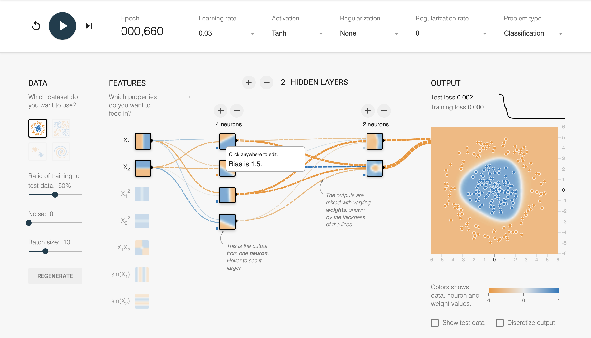
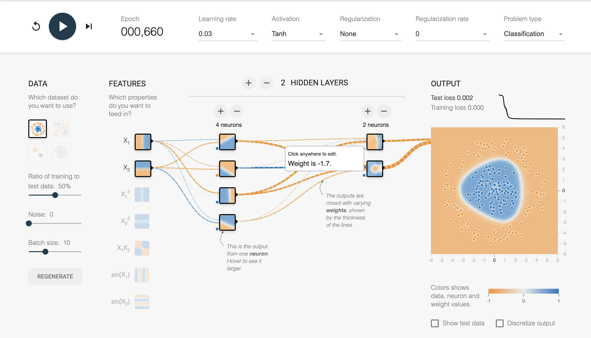
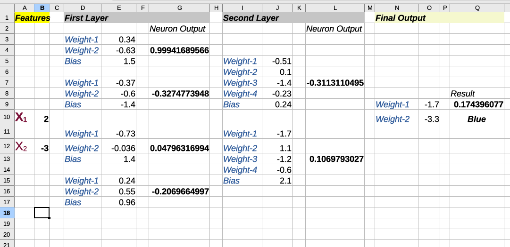

### How to understand TF Playground output

Let's say you've stopped the training at that point, and you want to see the parameters of your network:

To see the **Bias** of a neuron, hover the mouse over the bottom left small square of each neuron:

To see the **Weight**, hover the mouse over the incoming connector:

This way, you can gather **all** the parameters of your neural network.

This can be captured in a spreadsheet, like that:

- All the weights and Bias for each neuron are represented in the spreadsheet
- Features (on the left) are the input values
- Result (on the right) is the calculated result.

> The training consist in trying _all_ possible values for _all the weights_ and _all the bias_, to find the expected result.
> > This is Supervised Learning, we know what value we are expecting for each data ([x, y] => color).  
