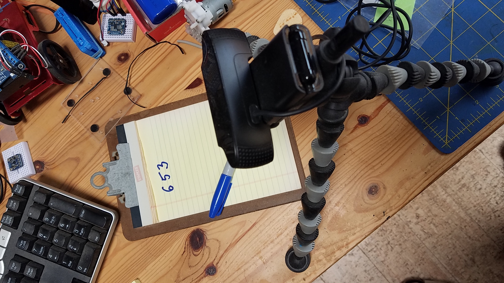

## Summary of the Python scripts
- `sample.01.py` Continuous Camera Capture, **_No Processing_**.
- `sample.05.1.py`
    - Can be used (see runtime options) to train the model (`training.h5`)
    - Will use images taken from the training data set to evaluate the digits it represents
- `sample.05.2.py`
    - Similar to `sample.05.1.py`, but with _your_ own images, from the file system.
    - Model `training.h5` must already exist
    - Uses OpenCV to reshape the images as expected by the model
- `sample.05.2.save.py` (uses and saves images on the file system).
- `sample.05.3.py`
    - Synopsis:
        - Enter digit images (file names) to compose number A
        - Enter operation (`+`, `-`, `*`, `/`)
        - Enter digit images (file names) to compose number B
        - Enter `=` to get the result
    - Model `training.h5` must already exist (generated by `sample.05.1.py`).
    - Use images from training or test dataset.
- `sample.05.21.py`
    - Similar to `sample.05.1.py`, but with _your_ own images, read _from the camera_ in real time.
    - **Keras Model `training.h5` must already exist** (generated by `sample.05.1.py`).
    - Uses OpenCV to read and reshape the images as expected by the model
        - 
        - Show an hand-written character to the camera
        - Hit `S` to have it recognized
        - More details [here](../README.md#your-own-hand-written-digits-recognition).
- `sample.05.21.py`, WIP
    - Reads a string of several digits, and speaks the result.
- `convnet/sample.01.py`
    - Digits recognition (from the MNIST db), Model training with a Convolutional Network (aka convnet)
    - Model can be saved from here too.
- `sample.06.py`
    - Images recognition, like dresses, shirts, shoes, etc.
- `python.scratch/several_digits.py`
    - Splitting a multi-digit hand-written number into specific characters (for recognition, see `sample.05.21.py`)
- `sample.07.01.py` Hand and fingers detection (WIP)
