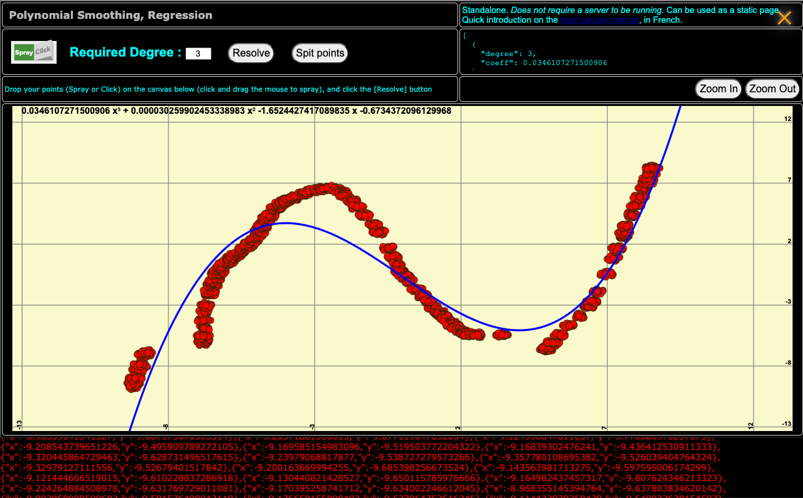
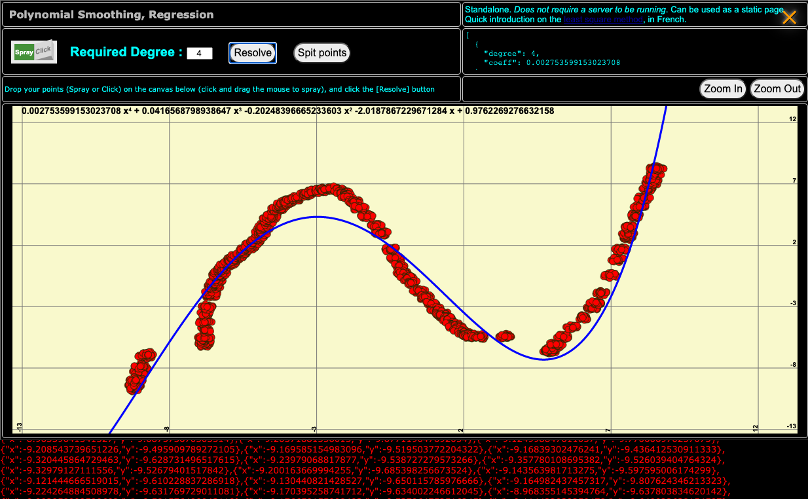
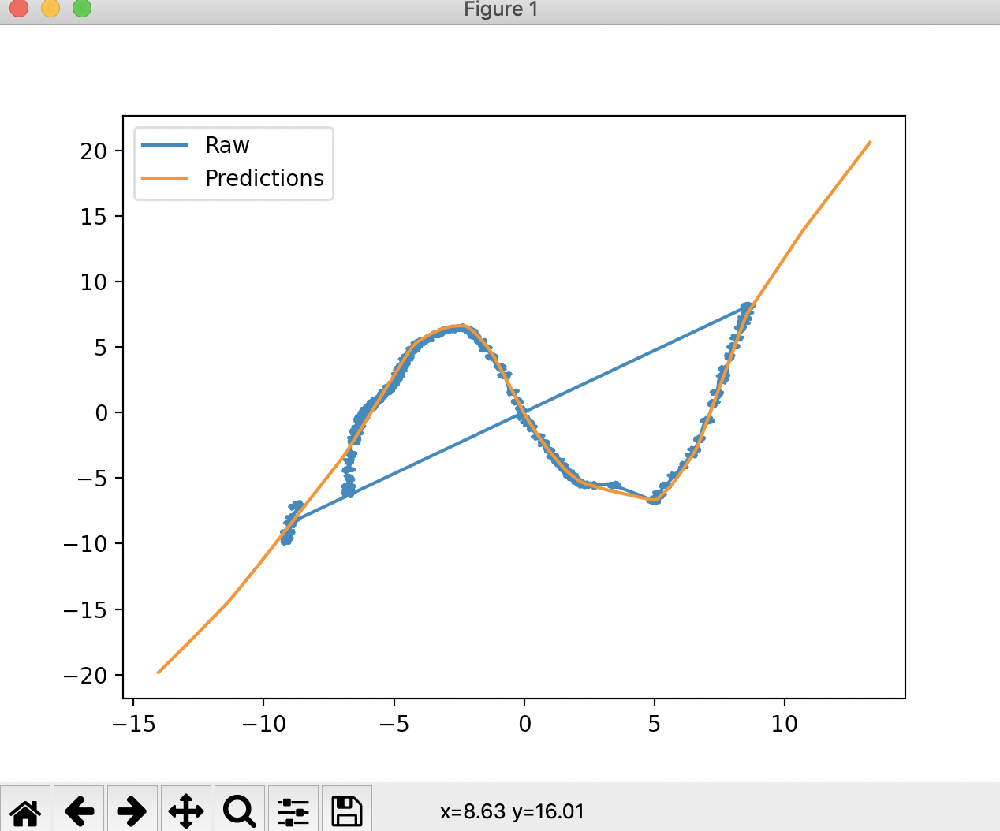
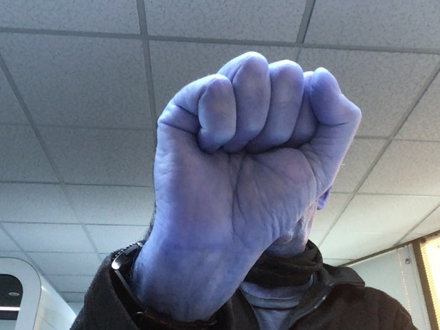
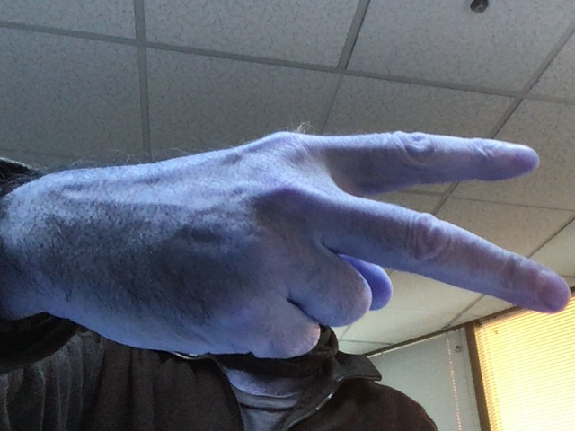
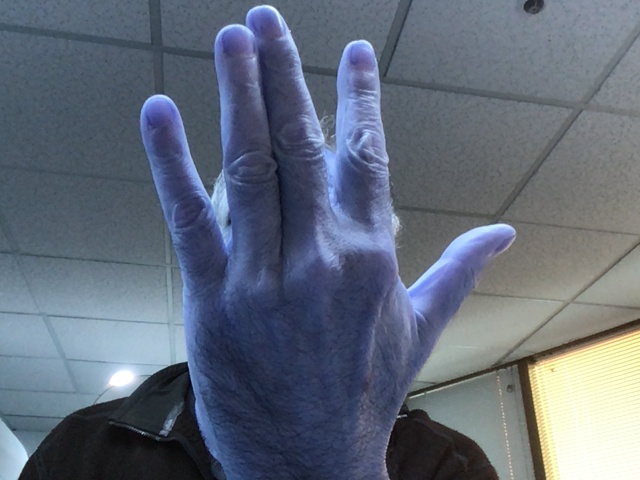

# TensorFlow Tutorials


Code from the TensorFlow tutorial videos at <https://www.tensorflow.org/tutorials>  
Full TensorFlow course (~7 hours) <https://www.youtube.com/watch?v=tPYj3fFJGjk>  
Installing TF on Debian 10 <https://itnext.io/installing-tensorflow-2-3-0-for-raspberry-pi3-4-debian-buster-11447cb31fc4>  

The scripts presented here might require
```
pip3 install tensorflow
pip3 install matplotlib
pip3 install scipy
pip3 install seaborn
pip3 install pandas
```
When OpenCV is needed, you can install it with 
```
pip3 install opencv-python
```

> _Note:_ All the data required by the model training steps will be downloaded by the 
> corresponding code.

## The simplest NN ever
Look in the code, it's worth it. One layer, one neuron!
- `01-function_guesser.py`

## Regression problem
- `02-01_02-regression.py`
  - Read data points from a JSON file to train a model, put to work after that.
> It might be interesting to compare this method with the Least Square method.  
> In <https://olivierld.github.io/>, in the Menu (hamburger): 
> - choose Single Page App stuff > A Full Modal Page,... , linear regression.
> - Spray ponts on the canvas
> - Choose the polynomial degree you want (here 3, and 4)
> - Hit the `[Resolve]` button
> - If you hit the `[Spit points]` button, you get the json content (in red, at the bottom) you can use with `02-01_02-regression.py`.

| Least Square Method                   | Neural Network Regression  |
|:-------------------------------------:|:--------------------------:|
|   |  |

It could be a good starting point to discuss under-fitting and over-fitting of a model.  
See in the code the available runtime/CLI parameters.

## Image classification
Model training, and image classification. Uses the `Fashion MNIST` data set.    
Use `02-fashion-mnist.py`.

## Convolutional Neural Network
Image transformation, using Convolutional Neural Network, not Image Processing (like OpenCV).  
See `03-convolutional_neural_networks.py`.

## Rock-Scissors-Paper
The script `04-bis_rock_paper_scissors_webcam.py` is extension of `04-image_classifier.py`, it uses
- A WebCam
- The model trained in `04-image_classifier.py`
It takes images from the WebCam to recognize `rock`, `paper`, or `scissors`. 

| Rock | Scissors | Paper |
|:-------------------:|:-------------------:|:-------------------:|
|  |  |  |

### The full process
- Get the dataset, and train the model.
  - Dataset `rps` contains images of rocks, papers, scissors.
  - Run `04-image_classifier.py`.  
  This will train the model, and apply it to some test data.
- Then, using the same trained model (`rps.h5`), run `04-bis_rock_paper_scissors_webcam.py`.
  - This requires `OpenCV` and a WebCam.  
    See in the code, comments will tell you how to install the requirements.
  - Instructions are provided at runtime (in the window's title and the console).  

---
