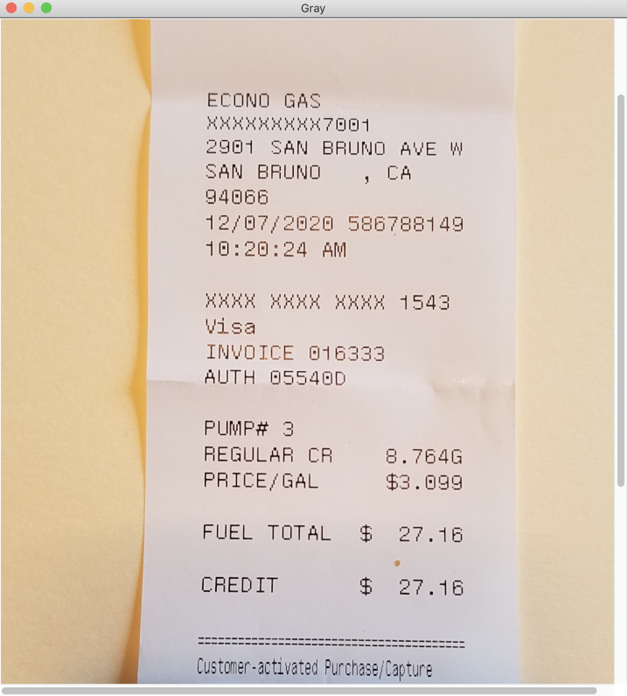
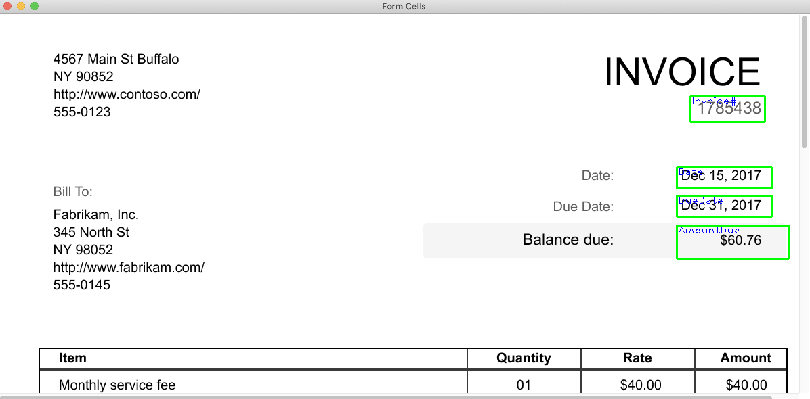
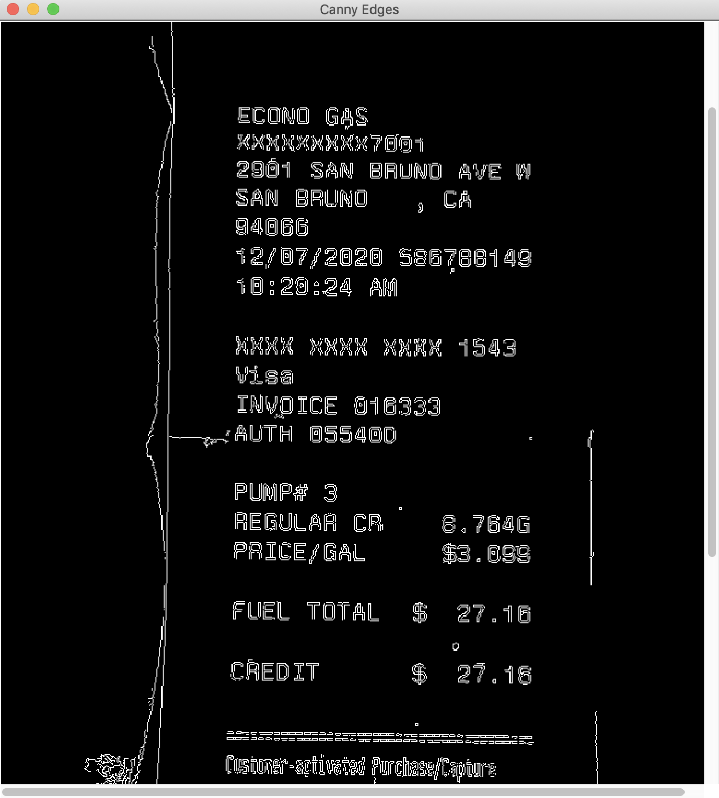
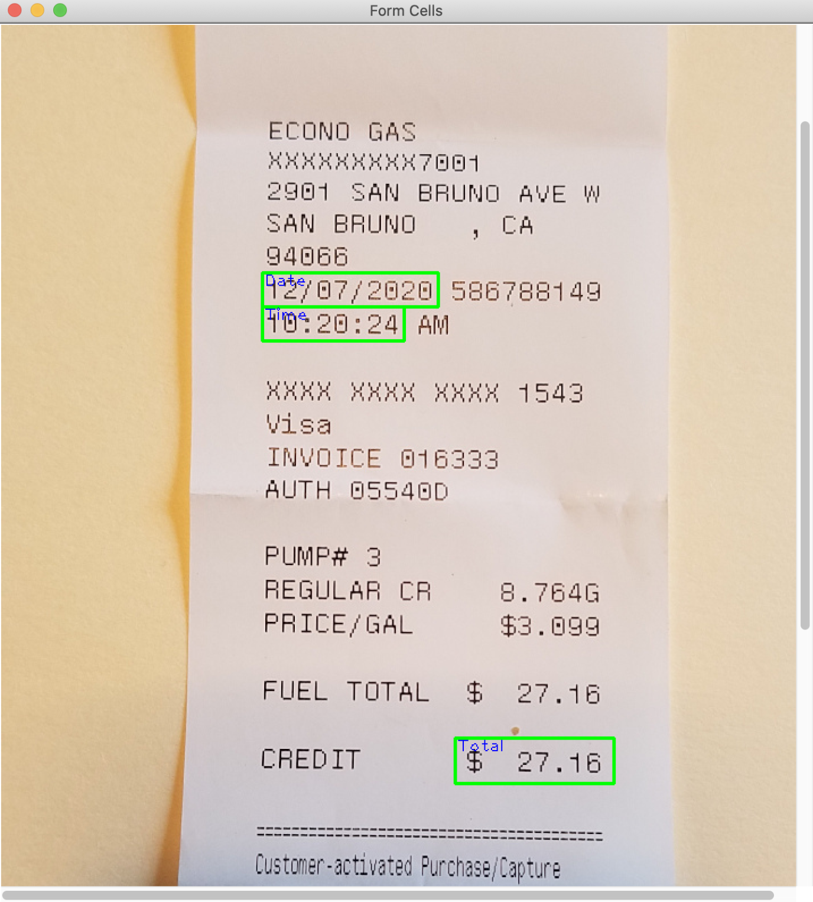

# Playground, scratch-pad...

- <https://nanonets.com/blog/receipt-ocr/>
- <https://www.pyimagesearch.com/2020/09/07/ocr-a-document-form-or-invoice-with-tesseract-opencv-and-python/>

> To check out: Microsoft OCR, LayoutLM, … Table processing 

### Processing images, with annotations (aka labels)
#### In Java, with OpenCV 🤔

We want to refer to some annotations, stored for now in `annotations.json`.
Those annotations describe the position (`[x,y]`) and size (`[w,h]`) of the zones of a graphical document
we want to process, like `Time`, `Date`, `Amount`, etc.

Once identified, we can then crop the corresponding zones, and send the cropped images
to some ML model for recognition.

OpenCV can reshape and rework an image, and can be access from `C`, `Java`, `Python`.
A lot of transformations are available, so the image can match the elements used for the model training.

We use the annotations like
```json
[
  {
    "x": 230,
    "y": 360,
    "w": 155,
    "h": 30,
    "cellName": "Date"
  },
  {
    "x": 230,
    "y": 390,
    "w": 125,
    "h": 30,
    "cellName": "Time"
  },
  {
    "x": 400,
    "y": 770,
    "w": 140,
    "h": 40,
    "cellName": "Total"
  }
]
```
on a document like


It can be reworked in several ways (even if not mandatory here)

|                             |                             |
|:---------------------------:|:---------------------------:|
|  |  |
|  |  |

The cropped images (to send for recognition):

| Date | Time | Amount |
|:----:|:----:|:------:| 
|  |  |  |

- An online service like <https://www.newocr.com/> (or Tesseract) can return the expected data.
 

---
 

