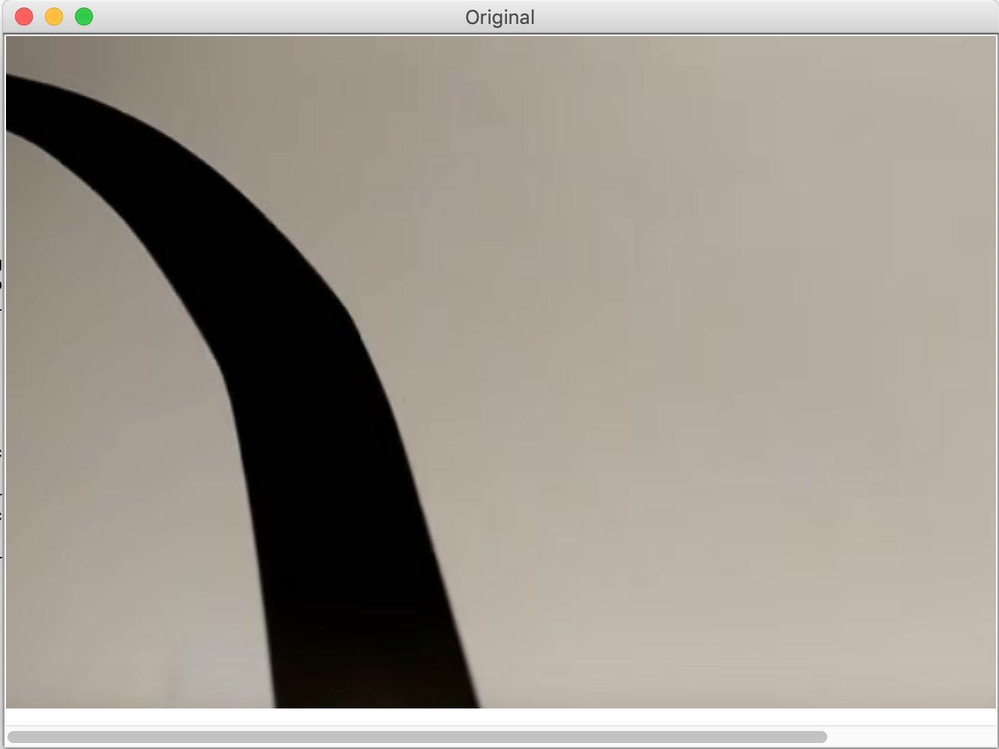
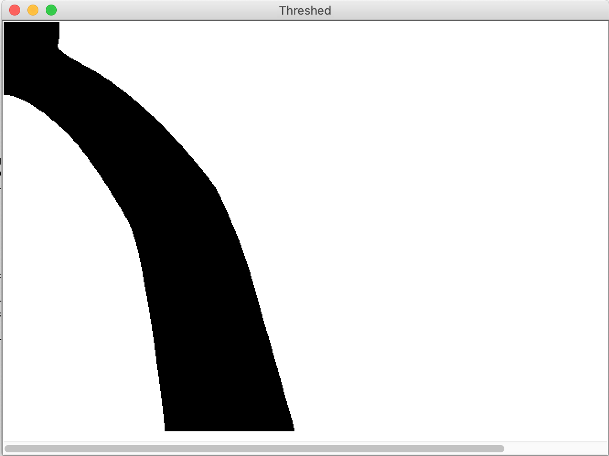
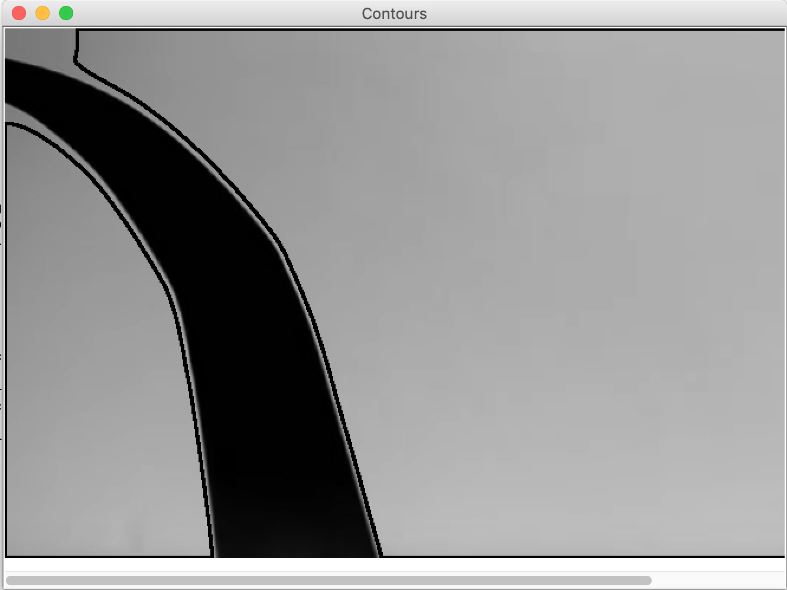
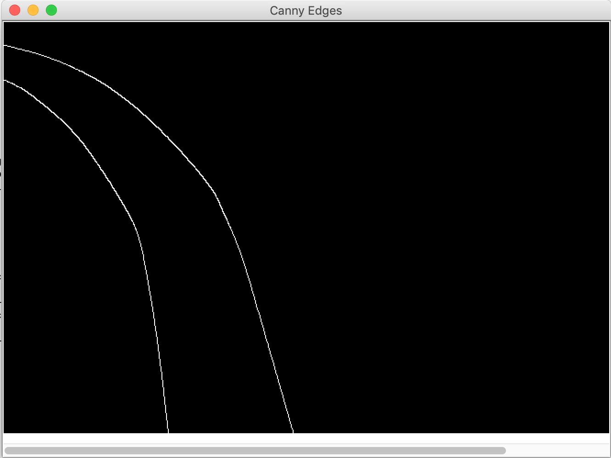
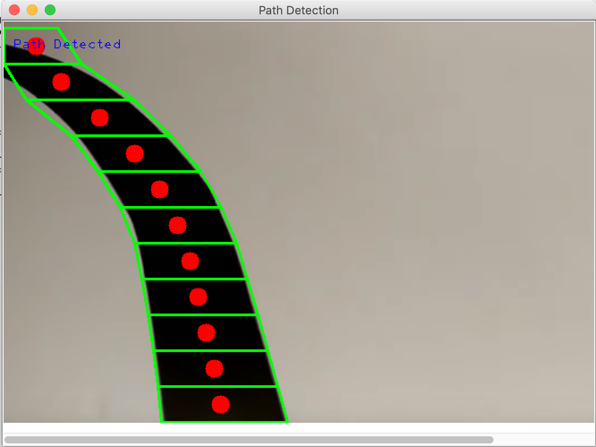
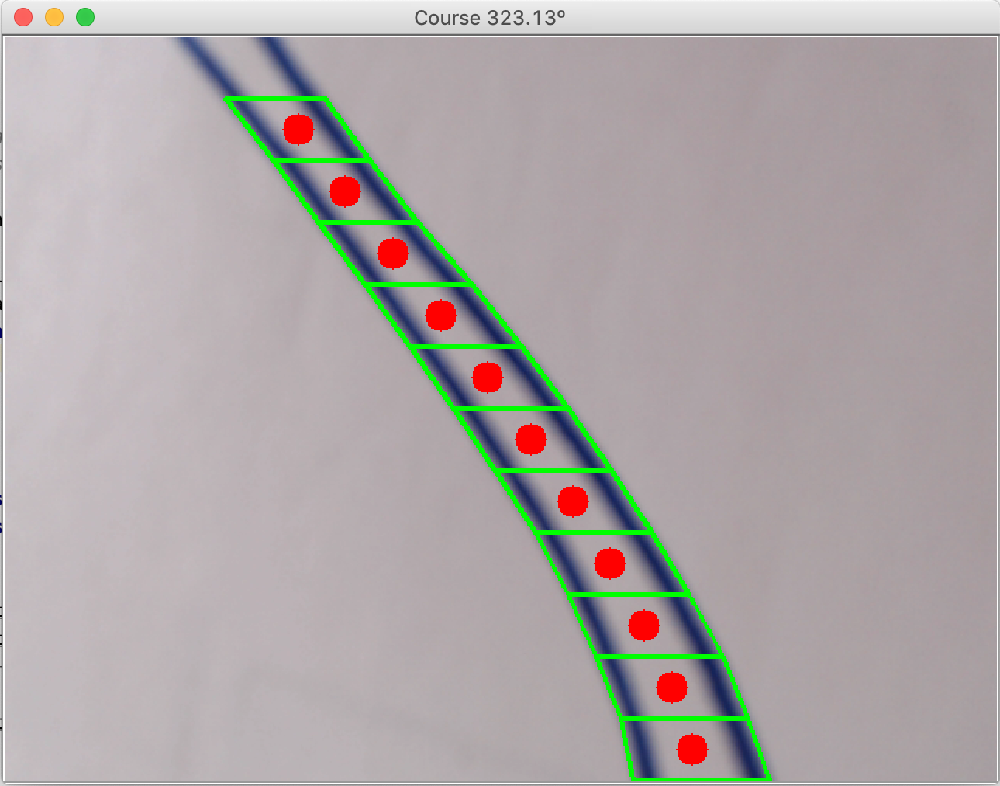
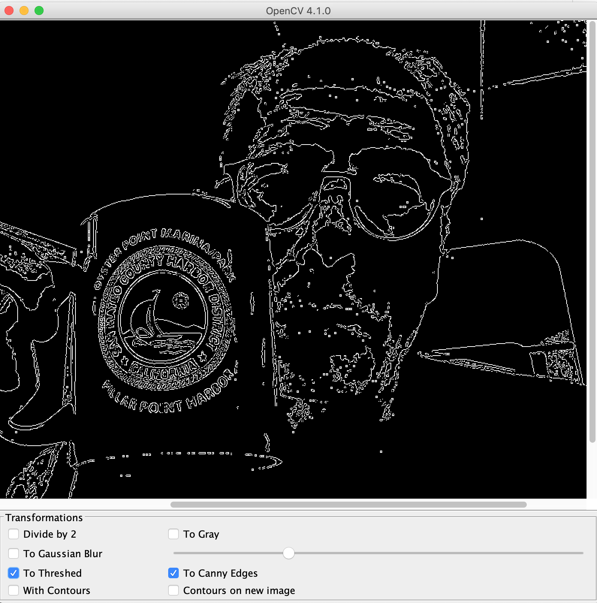
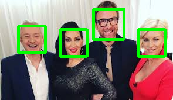
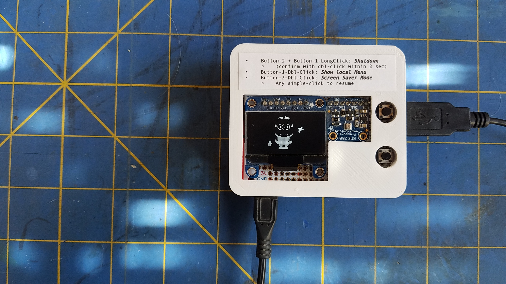

## OpenCV in Java and Python
This module is about `OpenCV`.

`OpenCV` is an Open Source project that can be used to rework images,
statically (rework one image) or dynamically (rework all frames grabbed from a camera).
This module contains numerous examples, in Python and Java, showing to perform those operations,
in order to prepare images before they're processed by a trained model.
> See about this last point the `Hand-written Digit Recognition` demo, in `JupyterNotebooks/deep.learning.crash.course/digit.demo`.

### Good resources, OpenCV & JavaFX
- <https://opencv-java-tutorials.readthedocs.io/en/latest/index.html>
- <https://github.com/opencv-java/>

#### For OpenCV on the Raspberry Pi
- <https://www.learnopencv.com/install-opencv-4-on-raspberry-pi/> <- Good start!
- [For Java](https://elbauldelprogramador.com/en/compile-opencv-3.2-with-java-intellij-idea/)
- <https://opencv-java-tutorials.readthedocs.io/en/latest/01-installing-opencv-for-java.html>
- <https://medium.com/@manishbansal8843/face-recognition-using-opencv-in-java-updated-8fc329863e52>
- [Motion detection](https://www.pyimagesearch.com/2016/01/18/multiple-cameras-with-the-raspberry-pi-and-opencv/)
---
- [Even for Scala](https://docs.opencv.org/3.4/d9/d52/tutorial_java_dev_intro.html)
---

### OpenCV on the Raspberry Pi?
> Detailed instructions:

OpenCV can pave the way for Artificial Intelligence and Image Recognition. 
We could certainly use its features here.

Installing OpenCV is not snappy, but it is not too difficult.

- Instructions are available at <https://opencv-java-tutorials.readthedocs.io/en/latest/01-installing-opencv-for-java.html#introduction-to-opencv-for-java>
- Also, worth a look: <https://www.learnopencv.com/install-opencv-4-on-raspberry-pi/>
- And <https://gist.github.com/ivanursul/146b3474a7f3449ec70729f5c7f946ee>

Some differences below with the scripts provided above...

### Other Systems
See <https://opencv-java-tutorials.readthedocs.io/en/latest/01-installing-opencv-for-java.html>.

> _Warning_ If you have a class version issue (55 vs 57 for example) you might need to upgrade your JDK... 

#### April-30, 2020.
Raspbian Buster comes with a JDK 11.
```
$ export JAVA_HOME=/usr/lib/jvm/java-11-openjdk-armhf
```
We will need `cmake`, make sure you have it available:
```
$ which cmake
```
If missing, install it:
```
sudo apt-get install build-essential cmake ant
```
Setting `ANT_HOME` may also recently fix issues:
```
$ export ANT_HOME=/usr/share/ant
```
---
### About `ant`:   
> During the build (around `99%`),`cmake` returned for `ant` a path like `/bin/ant`, whatever the `ANT_HOME` was set to.  
> There was on my box a symbolic link saying `../share/ant/bin/ant`, which was a problem...  
> It happened on Raspberry Pis, and other boxes, running Debian or Ubuntu.  
> I `unlinked` it, and recreated the link on `/bin/ant` with   
> ```
> sudo unlink /bin/ant  
> sudo ln -s /usr/share/ant/bin/ant /bin/ant.
> ```  
> That fixed the problem.
---
Also, you may want to install or update the followings:
```
sudo apt-get update
sudo apt-get upgrade
sudo apt-get install cmake gfortran
sudo apt-get install libjpeg-dev libtiff-dev libgif-dev
sudo apt-get install libavcodec-dev libavformat-dev libswscale-dev
sudo apt-get install libgtk2.0-dev libcanberra-gtk*
sudo apt-get install libxvidcore-dev libx264-dev libgtk-3-dev
sudo apt-get install libtbb2 libtbb-dev libdc1394-22-dev libv4l-dev
sudo apt-get install libopenblas-dev libatlas-base-dev libblas-dev
sudo apt-get install libjasper-dev liblapack-dev libhdf5-dev
sudo apt-get install protobuf-compiler
```

```
sudo apt-get update
sudo apt-get install libcblas-dev
sudo apt-get install libhdf5-dev
sudo apt-get install libhdf5-serial-dev
sudo apt-get install libatlas-base-dev
sudo apt-get install libjasper-dev 
sudo apt-get install libqtgui4 
sudo apt-get install libqt4-test
sudo apt-get libilmbase-dev
sudo apt-get libopenexr-dev
sudo apt-get libgstreamer1.0-dev
sudo apt-get libavcodec-dev
sudo apt-get libavformat-dev
sudo apt-get libswscale-dev
sudo apt-get libwebp-dev
```

- Download the last sources from <https://opencv.org/releases/>
  - Can be a `wget https://github.com/opencv/opencv/archive/4.3.0.zip`
    - or `wget https://github.com/opencv/opencv/archive/4.4.0.zip`...
    - or `wget https://github.com/opencv/opencv/archive/4.5.0.zip`...
    - or see for yourself at <https://opencv.org/releases/>, as mentioned above.
  - `mv 4.3.0.zip opencv-4.3.0.zip`
- `unzip opencv-4.3.0.zip`
- `cd opencv-4.3.0`
- `mkdir build`
- `cd build`
- Make sure your `$JAVA_HOME` is set
- `$ANT_HOME` is also useful in the last versions
- Make it (this `sudo make` below takes time, like hours...):
- ```
  cmake -D CMAKE_BUILD_TYPE=RELEASE \
        -D WITH_LIBV4L=ON \
        -D WITH_OPENCL=OFF \
        -D BUILD_PERF_TESTS=OFF \
        -D BUILD_SHARED_LIBS=OFF \
        -D JAVA_INCLUDE_PATH=$JAVA_HOME/include \
        -D JAVA_AWT_LIBRARY=$JAVA_HOME/lib/libawt.so \
        -D JAVA_JVM_LIBRARY=$JAVA_HOME/lib/server/libjvm.so \
        -D CMAKE_INSTALL_PREFIX=/usr/local ..
  ```
- `sudo make`
- `sudo make install`

After that, quick test, from Python
```
$ python3

>>> import cv2
>>> print(cv2.__version__)
4.3.0
>>>
```

You might also want to try a `sudo pip3 install opencv-python`.
> To install `pip3` if needed: `sudo apt install python3-pip`

Some location(s) to keep track of:
```
$ find /usr/local -name '*opencv*.jar' -exec ls -lisah {} \;
1075459 640K -rw-r--r-- 1 root root 639K Apr 30 10:09 /usr/local/share/java/opencv4/opencv-430.jar
```
- `/usr/local/share/java/opencv4/opencv-430.jar` will be used for the Java Classpath 
- `/usr/local/share/java/opencv4` will be used for the Java `-Djava.library.path`, as it contains a required system lib.

> Note: Version `4.5.2` leaves those guys under the `build` directory. Good to know...  
> The scripts presented here will reflect that.

```
ll /usr/local/share/java/opencv4/
total 20M
1075457 4.0K drwxr-xr-x 2 root root 4.0K Apr 30 10:21 .
1075456 4.0K drwxr-xr-x 3 root root 4.0K Apr 30 10:21 ..
1075458  20M -rw-r--r-- 1 root root  20M Apr 30 10:11 libopencv_java430.so
1075459 640K -rw-r--r-- 1 root root 639K Apr 30 10:09 opencv-430.jar
pi@rpi-buster:~/opencv-4.3.0/build $ 
``` 
> Note the paths above may change if you are not on Debian on Raspi OS.
> The `gradle` script(s) would be impacted.

JavaFX was removed from JDK 11, it's to be referred to as a module...

In order not to introduce un-necessary complexity, we will not be using it here.

For JavaFX, see [this](https://stackoverflow.com/questions/38359076/how-can-i-get-javafx-working-on-raspberry-pi-3).
 
---

### Face recognition, OpenCV and DL
- <https://www.freecodecamp.org/news/facial-recognition-using-opencv-in-java-92fa40c22f62/>

#### Misc bulk notes, scratch-pad, scribblings, etc.

> Great resource [here](https://docs.opencv.org/master/d9/df8/tutorial_root.html),
> samples in 3 languages: C++, Java, Python.

#### Java stuff
- find the `opencv` jar file, done during the build
```
Mac> ll /usr/local/Cellar/opencv/4.x.x_x/share/java/opencv4
```
or
```
$ find /usr/local -name 'opencv*.jar'
```

- Make sure you use at least Java 9.
```
 export JAVA_HOME=`/usr/libexec/java_home -v 9.0.1`
 ../gradlew run
 
```
> If this raises a `no opencv_java410 in java.library.path`,
> then you need (this is on Mac)
```
$ cd /usr/local/Cellar/opencv/4.x.x_x/share/java/opencv4
$ ln -s libopencv_java4xx.dylib libopencv_java4xx.so 
```
> If you see a `Library not loaded: /usr/local/opt/openssl/lib/libssl.1.0.0.dylib`
> then try
```
 $ cd /usr/local/opt/openssl/lib/
 $ ln -s libssl.dylib libssl.1.0.0.dylib 
```
Same for other libs, if any ( like `ln -s libcrypto.1.1.dylib libcrypto.1.0.0.dylib`)

See in [`build.gradle`](./build.gradle).

```
 ../gradlew runFX
```
And others:
```
 ../gradlew tasks --all
. . .
```

### Custom Java code
> Using Java Swing for the GUI.

#### Path detection on one image.
```
 ../gradlew runOlivSwing
```
| | | |
|:--------:|:--------:|:--------:|
| Original | Gray | Blur |
|  |  |  |
| Threshed | Contours | Canny Edges |
|  |  |  |
| Path detected! | | |
|  |  |  |

#### Continuous path detection
This could be the basis to drive a robot carrying the camera, as in `OpenCVContinuousPathDetection.java`:
```
 ../gradlew continuousPathDetect
```


#### Interactive, transforming images returned by the camera in real time.
Resize image, color to gray-scale, gaussian blur, threshold, canny edges, contours detection,
contrasts and brightness...
```
 ../gradlew runOlivSwingCamera
```
| Interactive transformations from Swing |
|:-----------------------------:|
|  |

#### Face detection, on an image
Run:
```
 ../gradlew faceDetect
``` 

| this | becomes | that |
|-----:|:-------:|:-----|
|  | => |  |

#### Continuous face detection
For continuous detection, see `OpenCVContinuousFaceDetection.java`, run
```
 ../gradlew continuousFaceDetect
``` 

#### Downgrading a color image to display on a led matrix
Here we want to render a colored image (RGB), on a led matrix.

Here are the steps:
- We start from the colored image
- We turn it to gray
- We thresh it
- We resize it (smaller)
- We store it in a file, custom format
- We can then display the image on the led matrix (oled screen here)

| Original | Gray | 
|:--------:|:----:|
|  |  |
| Threshed | Resized |  
|  |  |  

The level of details of the final display is obtained during the `threshold` part.
See in `OpenCVSwingColor2BW.java`:
```java
    // threshold
    Mat threshed = new Mat();
    Imgproc.threshold(gray,
            threshed,
            150, // 127,
            255,
            0);
``` 
Tweaking the `thresh` parameter (`150` above) leads to different results.

The final result is stored in a binary file (`image.dat`).
The matrix used here is 128x64 pixels big. The file will contain 64 lines of 2 `long`s.
A Java `long` has 64 bits, 2 `long`s make 128 bits, that's all we need to encode one line of 128 leds on the screen.
See the code in `OpenCVSwingColor2BW.java` for details.

| Swing Simulator | Real device |
|:---------:|:-----------:|
|  |  |


### In Python
See [here](./src/main/python/README.md)

#### Object Classification (Python too)
See [here](./src/main/python/object.detection/README.md)

---
