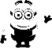
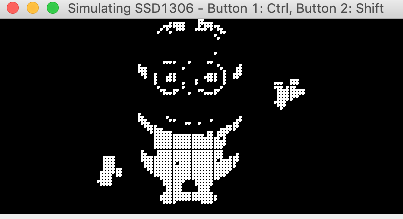

## OpenCV in Java and Python

### Good resources, OpenCV & JavaFX
- <https://opencv-java-tutorials.readthedocs.io/en/latest/index.html>
- <https://github.com/opencv-java/>

#### For OpenCV on the Raspberry Pi
- <https://www.learnopencv.com/install-opencv-4-on-raspberry-pi/> <- Good start!
- [For Java](https://elbauldelprogramador.com/en/compile-opencv-3.2-with-java-intellij-idea/)
- <https://opencv-java-tutorials.readthedocs.io/en/latest/01-installing-opencv-for-java.html>
- <https://medium.com/@manishbansal8843/face-recognition-using-opencv-in-java-updated-8fc329863e52>
- [Motion detection](https://www.pyimagesearch.com/2016/01/18/multiple-cameras-with-the-raspberry-pi-and-opencv/)
---
- [Even for Scala](https://docs.opencv.org/3.4/d9/d52/tutorial_java_dev_intro.html)
---

### Face recognition, OpenCV and DL
- <https://www.freecodecamp.org/news/facial-recognition-using-opencv-in-java-92fa40c22f62/>

#### Misc bulk notes, scratch-pad, scribblings, etc.

> Great resource [here](https://docs.opencv.org/master/d9/df8/tutorial_root.html),
> samples in 3 languages: C++, Java, Python.

#### Java stuff
- find the `opencv` jar file, done during the build
```
Mac> ll /usr/local/Cellar/opencv/4.1.0_2/share/java/opencv4
```
or
```
$ find /usr/local -name 'opencv*.jar'
```

- Make sure you use at least Java 9.
```
 export JAVA_HOME=`/usr/libexec/java_home -v 9.0.1`
 ../gradlew run
 
```
> If this raises a `no opencv_java410 in java.library.path`,
> then you need (this is on Mac)
```
$ cd /usr/local/Cellar/opencv/4.1.0_2/share/java/opencv4
$ ln -s libopencv_java410.dylib libopencv_java410.so 
```
> If you see a `Library not loaded: /usr/local/opt/openssl/lib/libssl.1.0.0.dylib`
> then try
```
 $ cd /usr/local/opt/openssl/lib/
 $ ln -s libssl.dylib libssl.1.0.0.dylib 
```
Same for other libs, if any ( like `ln -s libcrypto.1.1.dylib libcrypto.1.0.0.dylib`)

See in [`build.gradle`](./build.gradle).

```
 ../gradlew runFX
```

### Custom Java code
> Using Java Swing for the GUI.

#### Path detection on one image.
```
 ../gradlew runOlivSwing
```
| | | |
|:--------:|:--------:|:--------:|
| Original | Gray | Blur |
|  |  |  |
| Threshed | Contours | Canny Edges |
|  |  |  |
| Path detected! | | |
|  |  |  |

#### Continuous path detection
This could be the basis to drive a robot carrying the camera, as in `OpenCVContinuousPathDetection.java`:
```
 ../gradlew continuousPathDetect
```


#### Interactive, transforming images returned by the camera in real time.
Resize image, color to gray-scale, gaussian blur, threshold, canny edges, contours detection,
contrasts and brightness...
```
 ../gradlew runOlivSwingCamera
```
| Interactive transformations from Swing |
|:-----------------------------:|
|  |

#### Face detection, on an image
Run:
```
 ../gradlew faceDetect
``` 

| this | becomes | that |
|-----:|:-------:|:-----|
|  | => |  |

#### Continuous face detection
For continuous detection, see `OpenCVContinuousFaceDetection.java`, run
```
 ../gradlew continuousFaceDetect
``` 

#### Downgrading a color image to display on a led matrix
Here we want to render a colored image (RGB), on a led matrix.

Here are the steps:
- We start from the colored image
- We turn it to gray
- We thresh it
- We resize it (smaller)
- We store it in a file, custom format
- We can then display the image on the led matrix (oled screen here)

| Original | Gray | 
|:--------:|:----:|
|  |  |
| Threshed | Resized |  
|  |  |  

The level of details of the final display is obtained during the `threshold` part.
See in `OpenCVSwingColor2BW.java`:
```java
    // threshold
    Mat threshed = new Mat();
    Imgproc.threshold(gray,
            threshed,
            150, // 127,
            255,
            0);
``` 
Tweaking the `thresh` parameter (`150` above) leads to different results.

The final result is stored in a binary file (`image.dat`).
The matrix used here is 128x64 pixels big. The file will contain 64 lines of 2 `long`s.
A Java `long` has 64 bits, 2 `long`s make 128 bits, that's all we need to encode one line of 128 leds on the screen.
See the code in `OpenCVSwingColor2BW.java` for details.

| Swing Simulator | Real device |
|:---------:|:-----------:|
|  |  |


### In Python
See [here](./src/main/python/README.md)

#### Object Classification (Python too)
See [here](./src/main/python/object.detection/README.md)

---
